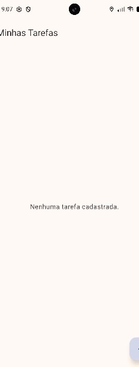
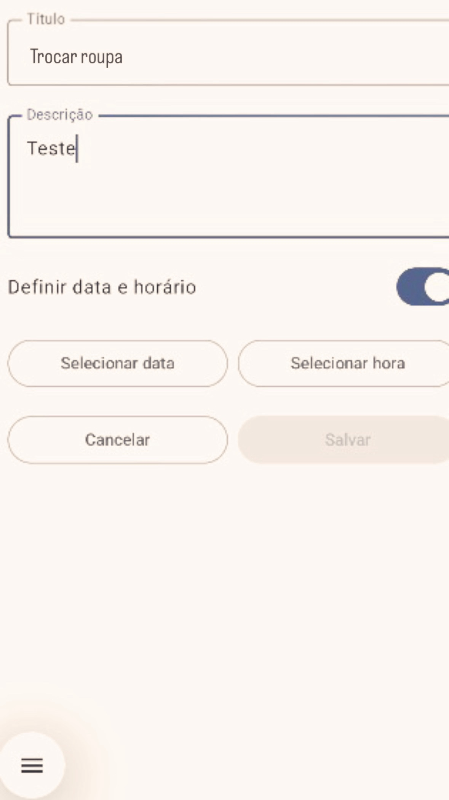
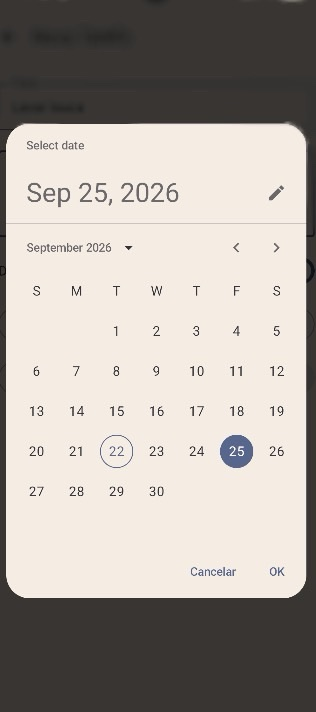
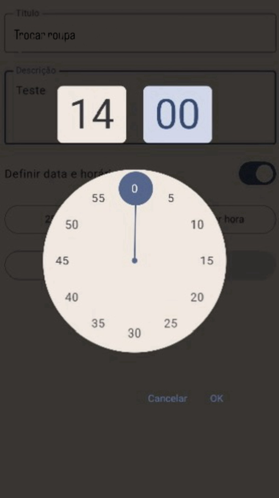
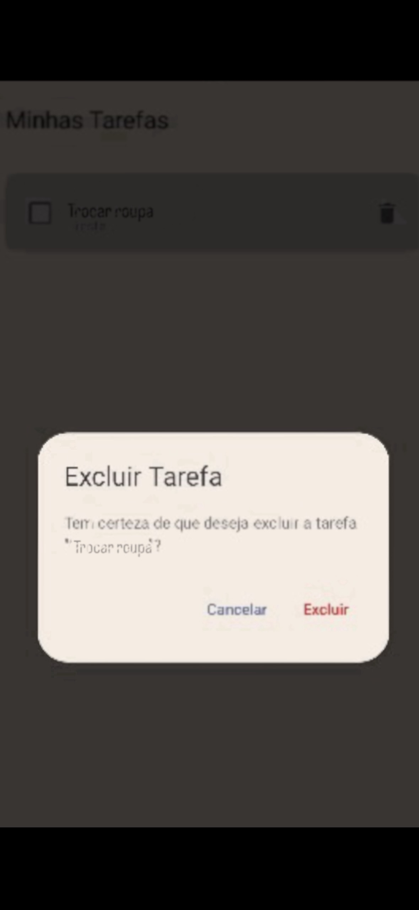

# Evidências da Funcionalidade de Exclusão com Confirmação

---

## 1. Lista de tarefas vazia

**Arquivo:** `docs/images/exclusao/Image-checkpoint1.jpg`

Esta é a tela inicial **Minhas Tarefas** sem nenhuma tarefa cadastrada. No centro aparece a mensagem *"Nenhuma tarefa cadastrada."*. No canto inferior direito fica o botão flutuante (FAB) que abre o cadastro de uma nova tarefa.

---

## 2. Formulário de cadastro preenchido

**Arquivo:** `docs/images/exclusao/Image-checkpoint3.jpg`

Esta é a tela de criação de tarefa, com os campos preenchidos:

- **Título:** `Trocar roupa`
- **Descrição:** `Teste`
- **Definir data e horário:** chave ativada, o que mostra os botões **Selecionar data** e **Selecionar hora**.

O botão **Salvar** fica desabilitado enquanto a data e o horário não forem escolhidos. Isso impede que a tarefa seja salva com informações incompletas. O botão **Cancelar** descarta o cadastro.

---

## 3. Seleção da data

**Arquivo:** `docs/images/exclusao/Image-checkpoint2.jpg`

Ao tocar em **Selecionar data**, abre o seletor de data (`DatePicker`) do Material 3. Na imagem:

- O dia atual (**22 de setembro de 2026**) aparece destacado com um contorno.
- A data escolhida é **25 de setembro de 2026** (*Sep 25, 2026*), marcada em azul.
- O botão **OK** confirma a data e o botão **Cancelar** fecha o seletor sem alterar nada.

---

## 4. Seleção do horário

**Arquivo:** `docs/images/exclusao/Image-checkpoint5.jpg`

Ao tocar em **Selecionar hora**, abre o seletor de horário (`TimePicker`) do Material 3 em formato de relógio analógico. O horário escolhido é **14:00**. O campo de minutos está ativo, com o ponteiro no `0`.

Ao fundo aparece o formulário com o título *"Trocar roupa"* e a descrição *"Teste"*. O botão de data já mostra o dia escolhido na etapa anterior. O botão **OK** confirma o horário.

---

## 5. Diálogo de confirmação de exclusão

**Arquivo:** `docs/images/exclusao/Image-checkpoint4.jpg`

Depois de salva, a tarefa **"Trocar roupa"** (descrição *"Teste"*) aparece na lista **Minhas Tarefas**. Ela tem uma caixa de seleção para marcar como concluída e um ícone de lixeira para excluir.

Ao tocar na lixeira, abre um `AlertDialog` do Material 3 sobre a lista, que fica escurecida ao fundo. O diálogo contém:

- **Título:** *Excluir Tarefa*
- **Mensagem:** *Tem certeza de que deseja excluir a tarefa "Trocar roupa"?*, com o nome da tarefa selecionada para evitar exclusões por engano.
- **Cancelar:** fecha o diálogo e mantém a tarefa na lista.
- **Excluir** (em vermelho, por ser uma ação destrutiva): remove a tarefa de forma definitiva e atualiza a lista.

---